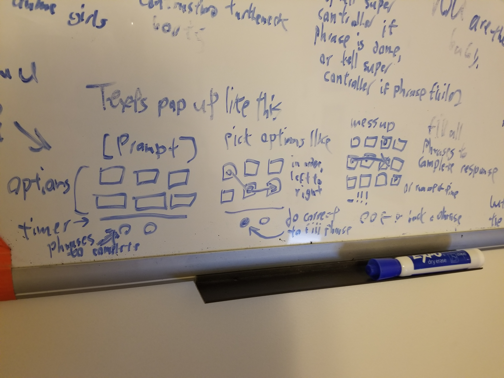

**Prompts** are the individual bits of gameplay interaction that aren't Lex's phone. Whenever a person (such as a text or a friend in the bar), a **PromptControl** will pop up, which is made up of:

**Prompt Text**: The actual thing the other person said. Non-dynamic, it just needs to be read.

**Prompt Buttons Manager**: *The interactable gameplay bits, often called 'Phrases' in code. A *Prompt Buttons Manager* is made up of several PromptWordVBoxContainer and a *Timer*. 

The *timer* is a scrolling bar that moves from right to left as timer passes. If the timer reaches zero, the PromptButton button automatically fails.

Each *PromptWordVBoxContainer* contains a column of buttons. Each button is labeled with a word and a tint: either the word in the phrase and a green tint or a nonsense word and no tint. If the columns are pressed out of order, or the wrong button in a column is pressed, the phrase fails. Even if a column is correctly done, if it's pressed again, the phrase will fail.

**Prompt Markers**: Will mark how many PromptButtons need to be completed to resolve the prompt. Succeeding a PromptButton fills a Marker. Failing a PromptButton unfills the a Marker. Nothing bad happens if you fail with no Markers. If you fill all the Markers, the Prompt is succeeded, and it fades into the background (if on the phone) or fades away (if a spoken Prompt).

Prompts will either appear as a text message in Lex's phone (she needs to manually enter into her text contacts to answer them) or spoken by a friend as a blocking speech bubble that gets in the way of Lex's phone.